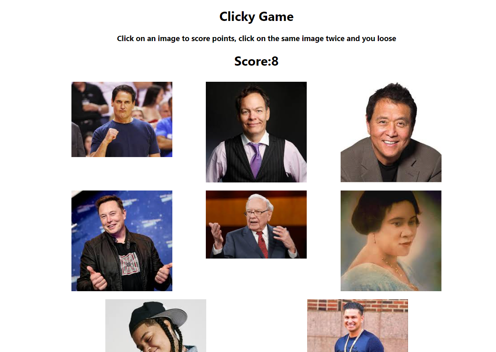

# Memory Game
 create a memory game with React. Break up your application's UI into components, manage component state, and respond to user events.
<br>
===========


<br>

## Break UI into components

```
<Jumbotron fluid>
            <container>
                <h1>Clicky Game</h1>
                <h3>Click on an image to score points, click on the same image twice and you loose</h3>
            </container>
        </Jumbotron>
```
<br>

## Manage State

```
    constructor(props) {
        super(props)
        this.state = {
            clickedImages: [],
            score: 0,
            gameOver: false
        }
    }
```
<br>

## Respond to User Events

```
  {
                                        // push item array 
                                        // copy state and create new var
                                        // add images to it 
                                        // update state
                                        // add if statement to only allow first time clicked images to array
                                        if (this.state.clickedImages.includes(item)) {

                                            // set new state of score to 0 display game over
                                            let newState = { ...this.state }
                                            newState.gameOver = true
                                            newState.score = 0
                                            this.setState(newState)

                                        }
```

<br>

## Built With

* [HTML](https://developer.mozilla.org/en-US/docs/Web/HTML)
* [CSS](https://developer.mozilla.org/en-US/docs/Web/CSS)
* [Javascript](https://developer.mozilla.org/en-US/docs/Web/JavaScript)
* [Bootstrap](https://getbootstrap.com/)

## Deployed Link

* [See Live Site](https://jas-f.github.io/memory-game/)

## License

This project is licensed under the MIT License 

See also the list of [contributors](https://github.com/your/project/contributors) who participated in this project.

## Prerequisites

Git hub,
Git lab,
Git bash,
Visual studio,
Google chrome,
Bootstrap,
JavaScript,
JQuery

## Authors

**Jasmine Franklin C: 301-332-2313 E: jasminer.franklin@gmail** 

- [Link to Portfolio Site](https://jas-f.github.io/portfolio-3.0/)
- [Link to Github](https://github.com/)
- [Link to LinkedIn](https://www.linkedin.com/in/jasmine-franklin-8b08ba121)

<p>&copy; UC Berkeley Extension Bootcamp.</p>